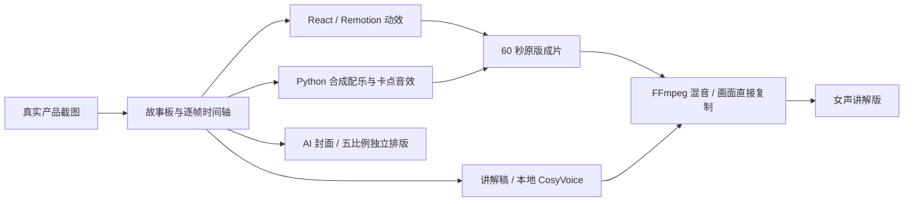

<div align="center">

### 🚀 本片主角 · 个人订单驾驶舱

## [去看真正的驾驶舱项目 →](https://github.com/jedliuai/trade-order-dashboard-demo)

**客户、合同、产品、发货、收款、利润，终于连成一条业务链。**

[](https://github.com/jedliuai/trade-order-dashboard-demo)
[](https://deskdemo.jedliuai.com/login)

---

# 广告公司要失业了？
## AI 一次直出宣传片

### 个人订单驾驶舱 · 开源制作工程

**项目作者：Jed杰德哥**

<a href="https://jedliuai.github.io/jed-order-dashboard-promo/">
  
</a>

[](https://jedliuai.github.io/jed-order-dashboard-promo/#watch)
[](https://github.com/jedliuai/jed-order-dashboard-promo/releases/latest)


[](https://github.com/jedliuai/jed-order-dashboard-promo/actions/workflows/verify.yml)
[](LICENSE)
[](MEDIA_LICENSE.md)

**从真实产品画面，到脚本、动效、递进配乐、讲解与社交封面。成片和制作过程，一起公开。**

</div>

> **先看产品，再看它的宣传片怎么做。** 本仓库是宣传片工程；业务系统本体请访问 **[jedliuai/trade-order-dashboard-demo](https://github.com/jedliuai/trade-order-dashboard-demo)**。演示界面中的客户与业务数据为虚构示例。

## 🎬 先看效果

| 你想看什么 | 入口 |
| --- | --- |
| 在线播放、试听与封面画廊 | **[打开项目展示页](https://jedliuai.github.io/jed-order-dashboard-promo/)** |
| 最终女声讲解版 · 1080p | [播放](https://jedliuai.github.io/jed-order-dashboard-promo/#watch) · [下载 MP4](https://github.com/jedliuai/jed-order-dashboard-promo/releases/latest/download/promo-60s-narrated.mp4) |
| 纯音乐与音效版 · 相同画面 | [播放](https://jedliuai.github.io/jed-order-dashboard-promo/#watch) · [下载 MP4](https://github.com/jedliuai/jed-order-dashboard-promo/releases/latest/download/promo-60s-music-only.mp4) |
| 五种比例封面 | [浏览封面](https://jedliuai.github.io/jed-order-dashboard-promo/#covers) · [下载 ZIP](https://github.com/jedliuai/jed-order-dashboard-promo/releases/latest/download/social-covers.zip) |
| 讲解、混音与声音素材 | [试听](https://jedliuai.github.io/jed-order-dashboard-promo/#audio) · [下载音频包](https://github.com/jedliuai/jed-order-dashboard-promo/releases/latest/download/audio-and-scripts.zip) |
| 脚本、字幕与时间轴 | [讲解稿](docs/narration-script.md) · [故事板](docs/storyboard.md) · [SRT](deliverables/subtitles-zh.srt) · [逐帧时间轴](edit/presentation/src/timeline-v4.json) |

影片画面保留“外贸订单驾驶舱”场景标题；项目与封面采用作者确认的名称“个人订单驾驶舱”。

## ✨ 60 秒，讲清一个项目

**告别在无数 Excel 之间重复填写、来回复制。** 合同一次登记，业务记录持续保存；客户、合同、产品、数量、金额、发货、收款与利润沿同一笔业务关联。发货和收款的后续进展仍需据实录入。

**从微观细节，看到宏观全局。** 订单执行、客户价值、产品表现、月份与财年、趋势和集中度，把日常工作积累成对业务的理解。收款平衡用橙绿标注区分“我方待交货”和“客户待付款”；导出中心展示六类报表，减少重复制表。

片中的“数小时 → 一次点击”表达流程价值，不是所有数据量下一秒完成的性能承诺。完整功能以 [产品仓库](https://github.com/jedliuai/trade-order-dashboard-demo) 为准。

| 开场 | 业务贯通 | 经营洞察 | 工作提效 |
| :---: | :---: | :---: | :---: |
| **一眼认出项目** | **8 个节点依次点亮** | **全局与细节同屏** | **把重复制表交给导出** |
| 绿色 Excel 图标呈现痛点 | 音调逐级升高，画面与声音卡点 | 客户矩阵、趋势、集中度、货款平衡 | 六类报表与真实下载反馈 |

<details>
<summary><b>展开 13 个场景与声音设计</b></summary>

| 时间 | 内容 |
| --- | --- |
| 0–3 秒 | 第一帧点题：外贸订单驾驶舱（个人订单驾驶舱的外贸业务场景） |
| 3–7 秒 | Excel 重复填写与复制的痛点 |
| 7–13 秒 | 客户 → 合同 → 产品 → 数量 → 金额 → 发货 → 收款 → 利润 |
| 13–19 秒 | 经营总览：完整展示，再连续推近 |
| 19–22 秒 | 今日优先事项 |
| 22–29 秒 | 合同到执行、发货与到账 |
| 29–34.5 秒 | 客户价值矩阵：右上高贡献、左下当前贡献较低 |
| 34.5–39 秒 | 客户、产品、时间和趋势，多维理解业务 |
| 39–43 秒 | 客户与产品集中度 |
| 43–47.5 秒 | 货款平衡：我方待交货 / 客户待付款 |
| 47.5–51 秒 | Excel 导出 |
| 51–55.5 秒 | 减少手工制表，六类报表 |
| 55.5–60 秒 | 品牌与两行 Demo 入口 |

配乐为 **120 BPM 渐进电子律动**：和弦与拨弦铺陈，鼓点、贝斯、高音旋律与更密集的打击层层加入，品牌落点保持高潮后收束。转场保留轻柔翻纸声；两处鼠标点击在 **20.6 秒、48.767 秒**；业务链八颗清脆音随节点升高。

[声音设计与测量](docs/music-design.md) · [最终验收](docs/video-validation.md)

</details>

## 🧩 这支片子是怎么做出来的



封面沿用作者确认的“一次直出”传播文案；实际制作经历了多轮反馈、调整和验收。这里公开的是 **GPT-6.1 Sol 协作制作的最终工程**：视频由代码编排和渲染，女声由本地模型合成，封面另行生成。[完整制作记录与复现边界](docs/production.md)。

讲解版直接复制原版的视频流，只新增解说和混音。两版的 **1,800 帧画面完全一致**，视频流 SHA-256 一致；已完成整片解码、音量测量、字幕与两处点击留白核验。[验收依据](docs/video-validation.md)。

## 🖼️ 一套封面，五种比例

奶油纸面、钴蓝标题、珊瑚橙强调。**“个人订单驾驶舱”大字突出，作者署名保留。** 各比例分别排版，人物/主要图形与标题没有通过简单裁切适配。

<table>
  <tr>
    <td align="center" width="50%"><a href="deliverables/covers/cover-4x3.png"></a><br><b>4:3</b> · 1448 × 1086</td>
    <td align="center" width="50%"><a href="deliverables/covers/cover-16x9.png"></a><br><b>16:9</b> · 1680 × 945</td>
  </tr>
  <tr>
    <td align="center"><a href="deliverables/covers/cover-3x4.png"></a><br><b>3:4</b> · 1086 × 1448</td>
    <td align="center"><a href="deliverables/covers/cover-9x16.png"></a><br><b>9:16</b> · 945 × 1680</td>
  </tr>
</table>

<p align="center"><a href="deliverables/covers/cover-1x1.png"></a><br><b>1:1</b> · 1254 × 1254</p>

[4:3 设计与最终改字提示词](docs/cover-4x3-provenance.json) · [其余比例提示词](docs/cover-prompts.json) · [竖版安全边距说明](docs/cover-portrait-safe-area.txt) · [导出记录](docs/verification/cover-export.json)

## 🛠️ 本地打开工程

直接观看和下载成片无需安装模型。编辑视频需要 **Node.js 22+**；音频处理需要 **Python 3.12+ 与 FFmpeg / ffprobe**。

```bash
git clone https://github.com/jedliuai/jed-order-dashboard-promo.git
cd jed-order-dashboard-promo/edit/presentation
npm ci
npm run studio
```

Studio 主合成为 `TradeDashboard`，场景预览在 `Final-Scenes`。渲染到根目录 `output/render/`，保留已批准的交付文件：

```bash
npm run check
npm run render
npm run render -- --stills --frames=0,240,450,1375,1750
```

Windows 自动寻找 Edge；其他系统由 Remotion 使用其浏览器环境，也可设置 `REMOTION_BROWSER_EXECUTABLE`。原片使用 Microsoft YaHei / Segoe UI，其他系统应准备可用中文字体；替代字体可能改变排版。

重做声音、调整讲解或运行验收请看 **[音频复现指南](docs/audio-workflow.md)**。已生成的 15 段女声全部附带；重新混音无需先安装 CosyVoice。重新生成语音才需要自行准备模型和“女主播”预设。

## 📦 目录导航

```text
deliverables/          两版最终 MP4、讲解音轨、完整混音、字幕、五比例封面
edit/presentation/     React / Remotion 画面源码、真实截图、逐帧时间轴
edit/audio/            渐进配乐、递升音与翻纸总线的合成源码
edit/narration/        讲解任务、15 段 WAV、本地 TTS、混音与验证工具
docs/                  故事板、讲解稿、制作记录、提示词与验收数据
tools/                 素材清单与包完整性检查
index.html             可直接部署的项目展示页
SHA256SUMS.txt          最终成片、声音与封面的校验值
```

只收录最终交付和所需源码。模型权重、私有配置、登录信息、运行缓存与历史候选稿不随这份公开工程分发。

## 🤝 一起做更好的作品

欢迎 Star、Fork，也欢迎分享你的改编。[提交问题](https://github.com/jedliuai/jed-order-dashboard-promo/issues) · [讨论制作](https://github.com/jedliuai/jed-order-dashboard-promo/discussions) · [贡献说明](CONTRIBUTING.md)

原创代码 **[MIT](LICENSE)**；作者可授权的原创媒体 **[CC BY 4.0](MEDIA_LICENSE.md)**。第三方音效、Remotion、模型、字体等保留各自条款，详见 **[来源与许可](NOTICES.md)**。

---

<div align="center">

### 宣传片只是入口。业务全局，才是主角。

## [探索「个人订单驾驶舱」 →](https://github.com/jedliuai/trade-order-dashboard-demo)

**项目作者：Jed杰德哥** · [GitHub @jedliuai](https://github.com/jedliuai)

</div>
